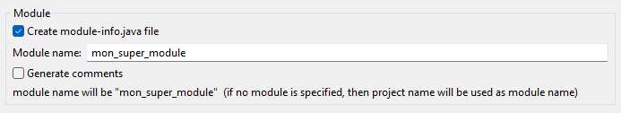
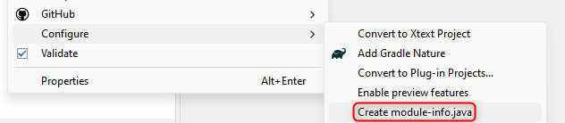
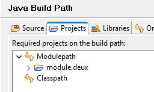

# TD n°1 - Reflection / Annotations / Modules

Ce premier TD a pour objectif de vous familiariser avec 3 concepts abordés en cours.

## Reflection

Dans cette première partie, nous allons explorer les possibilités offertes par la « reflection ».
Nous allons pour cela écrire une méthode qui gère la sérialisation d'une instance quelconque en
[JSON](https://www.json.org/json-fr.html).

```java
public class Json {

	public String write(Object instance) {
		// TODO générer ici la représentation json de instance
		return null;
	}

}
```

Ecrivez une première version de l'algorithme qui sérialise uniquement les nombres.

```java
new Json().write(42);		// 42
new Json().write(3.14f);	// 3.14
```

Étoffez votre code pour gérer les autres types en suivant ces indications :
* La méthode `write()` doit au final gérer le `null`, les types simples `int`, `long`, `float`, `double`, `boolean`, et `String`,
  ainsi que les objets et les tableaux d'un des types précédemment cités.
  * exemple : `[2, {"a": "b"}, 5.3, [true]]`
* Pour les objets, les propriétés à sérialiser sont déterminées par les _getters_
  * un _getter_ est une méthode sans argument dont le nom commence par "get"
  * exemple : `getProp()` donne la valeur de la propriété "prop"
* Les propriétés des objets JSON doivent être représentées en convention _snake case_

💡 Pour les objets, vous n'êtes pas obligés de gérer l'héritage, uniquement les getters « déclarés » dans l'instance fournie.

**Quelques conseils** :

* Travaillez de manière itérative, et construisez des cas de tests à chaque étape
* Pour ne pas écrire du code inutile, je vous rappelle que tout nombre en Java hérite de `java.lang.Number`.
* La méthode `getClass()` appelée sur une instance permet de récupérer sa `Class` (i.e. sa définition)
* Une instance de `Class<X>` permet de lister les méthodes, les propriétés, ... défini(e)s par la classe X.
* La méthode `Class::isAssignableFrom()` devrait vous être utile, l'operateur `instanceof` également
* Le type des éléments d'un tableau est obtenu avec la méthode `Class::getComponentType()`,
  cette méthode renvoie `null` si la classe n'a pas le type tableau.

## Annotations

Nous allons améliorer notre librairie en ajoutant des options permettant d'affiner la transformation en JSON.
Créez une annotation `@JsonIgnore` qui ne peut s'appliquer que sur un _getter_, et indique de ne pas sérialiser
la propriété associée. Modifiez votre classe `Json` pour la prendre en compte.

```java
    @JsonIgnore
    public String getIgnore() { return "ignore me !"; }
    // la propriété "ignore" ne fera pas partie du json résultant
```

Créez une seconde annotation `@JsonProperty` qui permet de renommer une propriété lors de la (dé)sérialisation.
Elle doir prendre en paramètre le nouveau nom de la propriété.

```java
    @JsonProperty("hello")
    public String getProperty() { return "world"; }
    // génèrera le flux json « "hello": "world" »
```

## Modules

Nous allons éclater notre projet en 3 modules :
* `module.helpers` va conserver les classes utilitaires (`CaseUtils`)
* `module.lib` va constituer notre librairie de sérialisation json (`Json`)
* `module.test` va contenir une classe de test pour notre librairie

Au niveau des dépendances, on va donc avoir : 
```
  ┌─────────────┐           ┌────────────┐           ┌────────────────┐ 
  │ module.test ├──utilise─►│ module.lib ├──utilise─►│ module.helpers │  
  └─────────────┘           └────────────┘           └────────────────┘  
```

Ecrivez les fichiers `module-info.java` qui vont bien pour chaque module.
Exécutez votre programme et expliquez l'erreur que vous obtenez.
Que devez-vous faire pour la résoudre ?

**Compléments** : L'intégration des modules dans Java remonte à quelques années
maintenant (sept. 2017), et pourtant les IDEs ne sont pas toujours
très copains avec cette notion.

### Eclipse

Avec Eclipse, chaque module doit se situer dans son propre projet.

Pour créer un module, initialisez un projet de type "Java Project". Par soucis de simplicité, utilisez
le nom du module comme nom de projet, et cochez la case "Create module-info.java file":



Si vous oubliez de cocher, vous pouvez toujours ajouter le `module-info.java` ultérieurement par un clic droit sur le projet.



Si un module a une dépendance sur un autre (_requires_), il faut mettre à jour son _build path_ manuellement.
Exemple : le module `module.un` a besoin d'un package du module `module.deux`, il faut ajouter `module.deux`
dans la liste des modules du _build path_.



Une fois ces manipulations effectuées, vous devriez pouvoir lancer votre application de test sans soucis.

### VsCode

VsCode ne sait pas vraiment gérer les modules mais peut utiliser les méta-données Eclipse
des projets Java. On va donc "tricher" en ajoutant un fichier `.project` et un `.classpath`
à nos projets pour qu'ils soient correctement gérés.

Dans chaque répertoire de module, créez un fichier `.projet` contenant le nom du module :

```xml
<?xml version="1.0" encoding="UTF-8"?>
<projectDescription>
	<name>nom du projet ici (utiliser le nom du répertoire)</name>
	<comment></comment>
	<projects>
	</projects>
	<buildSpec>
		<buildCommand>
			<name>org.eclipse.jdt.core.javabuilder</name>
			<arguments>
			</arguments>
		</buildCommand>
	</buildSpec>
	<natures>
		<nature>org.eclipse.jdt.core.javanature</nature>
	</natures>
</projectDescription>
```

Créez également un fichier `.classpath` comme suit 👇.

```xml
<?xml version="1.0" encoding="UTF-8"?>
<classpath>
	<classpathentry kind="src" path="src"/>
	<classpathentry kind="output" path="bin"/>
	<!-- vous pouvez ajuster la version de Java en modifiant l'identifiant `JavaSE-21` ci-dessous -->
	<classpathentry kind="con" path="org.eclipse.jdt.launching.JRE_CONTAINER/org.eclipse.jdt.internal.debug.ui.launcher.StandardVMType/JavaSE-21"/>
</classpath>
```

Pour les modules qui dépendent d'autres modules (_requires_), vous devrez rajoutez une section
permttant à java de savoir où aller chercher ces dépendances. Pour chacun, ajouter une section
`<classpathentry/> comme ci-dessous 👇 en ajustant le chemin vers le module requis.

```xml
    <classpathentry combineaccessrules="false" kind="src" path="/chemin vers le module requis">
        <attributes>
            <attribute name="module" value="true"/>
        </attributes>
    </classpathentry>
```

Vous devriez ensuite pouvoir exécuter votre application depuis VsCode.

### Lancement manuel

Si vous n'arrivez pas à configurer votre IDE, vous pouvez utiliser la ligne de commande.

> As per JEP 261 the --module-source-path option (for compilation in "multi-module mode")
> must point to a directory that holds one subdirectory for each contained module,
> where the directory name must equal the module name.

> To accommodate layouts where sources are not directly contained in the module directory,
> the option supports patterns where the token * can be used to represent the module name
> in any part of the path such as in "./*/src/main/java/", which will find the module
> my.mod1 in ./my.mod1/src/main/java/module-info.java etc.

> JEP 261 does not mention any contraints on where in the pattern * may occur, but apparently
> javac doesn't like patterns starting with *. This may or may not be intentional.

```bash
# commande à exécuter dans le répertoire racine qui stocke les modules
# on utilise des simples quotes pour éviter la résolution par le shell
% javac -d bin --module-source-path './*/src' $(find . -name "*.java")
% java --module-path bin -m module/package.ClasseContenantLeMain
```
